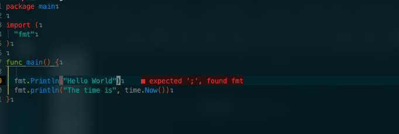

NeovimでGoの環境構築を行ったので、メモとして置いておきます.

<!--more-->

## 環境構築
### Pluginのinstall

まずはこのPluginを入れましょう

(私はPluginManagerにPackerを使用しています)

```Vim
  use 'hrsh7th/cmp-buffer'   -- nvim-cmp source for buffer words
  use 'hrsh7th/cmp-nvim-lsp' -- nvim-cmp source for neovim's built-in LSP
  use 'hrsh7th/nvim-cmp'     --Completion
  use 'neovim/nvim-lspconfig'
  use 'williamboman/mason.nvim'
  use 'williamboman/mason-lspconfig.nvim'
```

別途LSPについてはこちらの記事を見るといいと思います.

[Neovim+LSPをなるべく簡単な設定で構築する](https://zenn.dev/botamotch/articles/21073d78bc68bf
)

Pluginが入れ終わったら以下を行う

1. まず、mason.rc.luaというファイルを作成し以下を記述
    ```Vim
    local status, mason = pcall(require, "mason")
    if (not status) then return end
    local status2, lspconfig = pcall(require, "mason-lspconfig")
    if (not status2) then return end
    mason.setup({

    })
    lspconfig.setup(
      lspconfig.setup {
        ensure_installed = { 'gopls' }
      }
    )
    ```
2. その後、`:Mason`と打つことでgoplsがインストールされる
3. lspconfig.rc.luaと言うファイルを作成し以下を記述
    ```Vim
    local status, nvim_lsp = pcall(require, 'lspconfig')
    if (not status) then return end

    local on_attach = function(client, buffer)
      --formatting
      if client.server_capabilities.documentFormattingProvider then
        vim.api.nvim_command [[augroup Format]]
        vim.api.nvim_command [[autocmd! * <buffer>]]
        vim.api.nvim_command [[autocmd BufWritePre <buffer> lua vim.lsp.buf.format()]]
        vim.api.nvim_command [[augroup END]]
      end
    end

    -- Go
    nvim_lsp.gopls.setup {
      on_attach = on_attach
      filetypes = { "go", "gomod", "go.mod" }
    }
    ```

こうすることでGoの環境が作れると思います
### 使用例


このようにエラー等が表示されていればOKです.
